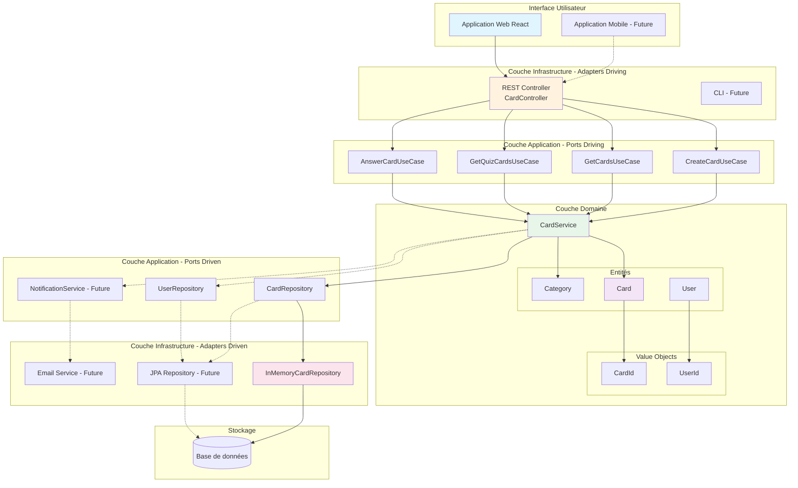
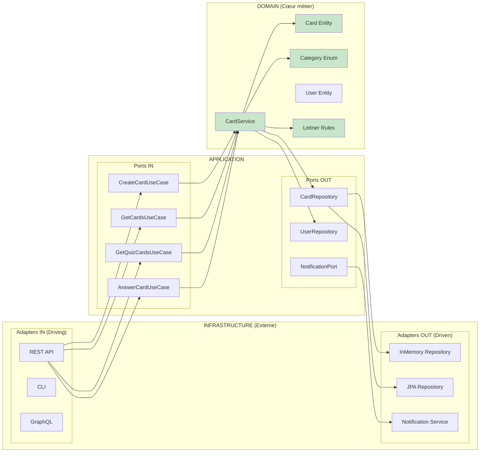
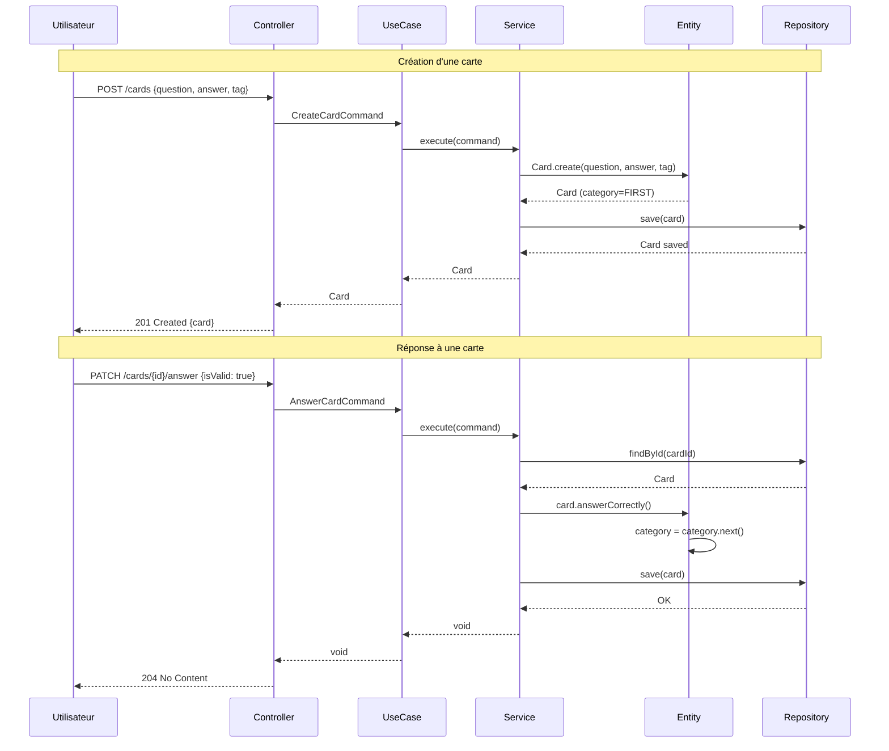
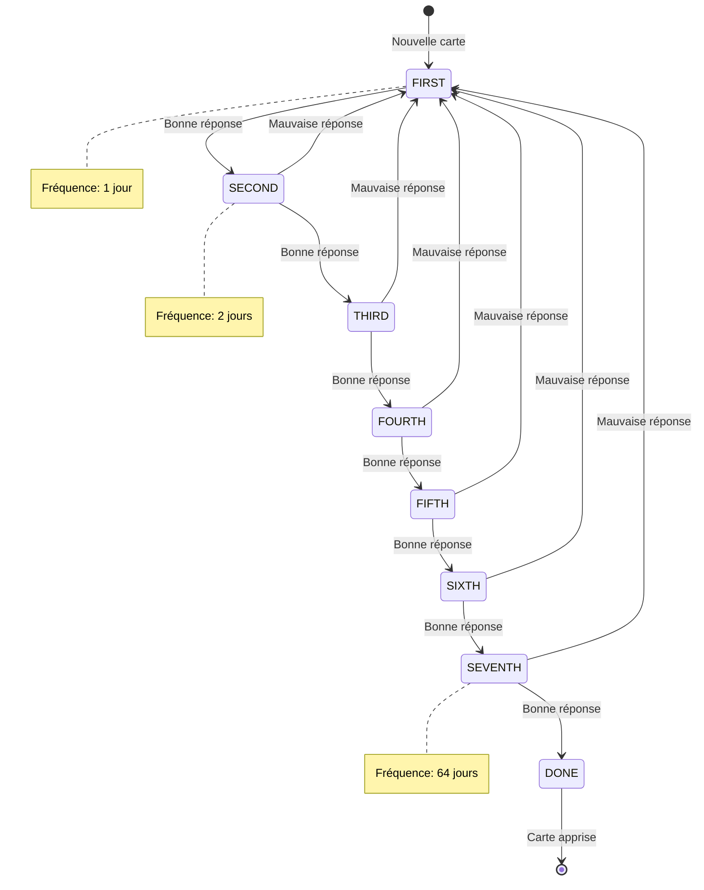

# Architecture Hexagonale - Système de Leitner

## Vue d'ensemble

## Architecture en couches détaillée

## Flux de données

## Règles métier du système de Leitner

## Fréquences de révision

| Catégorie | Fréquence | Description |
|-----------|-----------|-------------|
| FIRST | 1 jour | Révision quotidienne |
| SECOND | 2 jours | Tous les 2 jours |
| THIRD | 4 jours | Tous les 4 jours |
| FOURTH | 8 jours | Toutes les semaines |
| FIFTH | 16 jours | Toutes les 2 semaines |
| SIXTH | 32 jours | Tous les mois |
| SEVENTH | 64 jours | Tous les 2 mois |
| DONE | - | Carte définitivement apprise |
